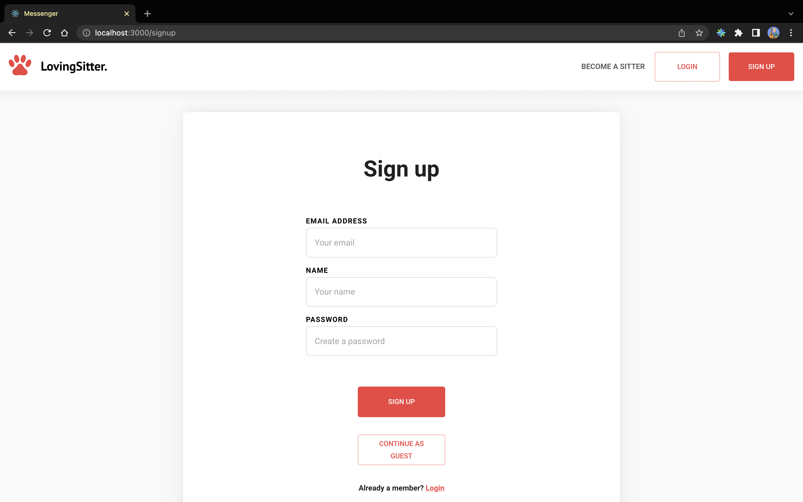

# LovingSitter

> A community-based online platform for Pet Owners and Pet Sitters to schedule visits 🐶

> Register to become a Pet Owner to start browsing Pet Sitters to watch over your pet while you are away 🐢

> Become a Pet Sitter if you'd like partake in the fun of pet sitting! 💰

## Features

- Search by location to browse the Pet Sitter Profile listings.

- Setup your Pet Sitter Profile as a Pet Sitter by filling out your information and pay rate.

- (Coming Soon) Message your Pet Sitter or Pet Owner in real-time through the web app.

- (Coming Soon) Pay through the app using Stripe (~3% fee). **Note:** Fake Fee and Money.

### Tech Stack

- MongoDB, Express.js, React.js, Node.js, Typescript

### Contributors

- Edward O., Dennis J., Gill P.

---

## Demo

1. Registration. Users will be able to create a new account using their email and password.

2. Landing Page. Users can log in or jump right into the Pet Sitter profile listings from the landing page.

3. Photo Upload. Users can update their profile picture so we can see their beautiful faces!

4. Pet Sitter Profile Page. Setup your information and rate as a Pet Sitter

---

## Local Setup

### Server

1. Go into the server directory `cd server`
2. Run `npm install` to install packages
3. Create your environment variable (.env) file
4. Run `npm run dev` to start the server

---

### Client

1. Go into the client directory `cd client`
2. Run `npm install` to install packages
3. Run `npm start` to start the client side
